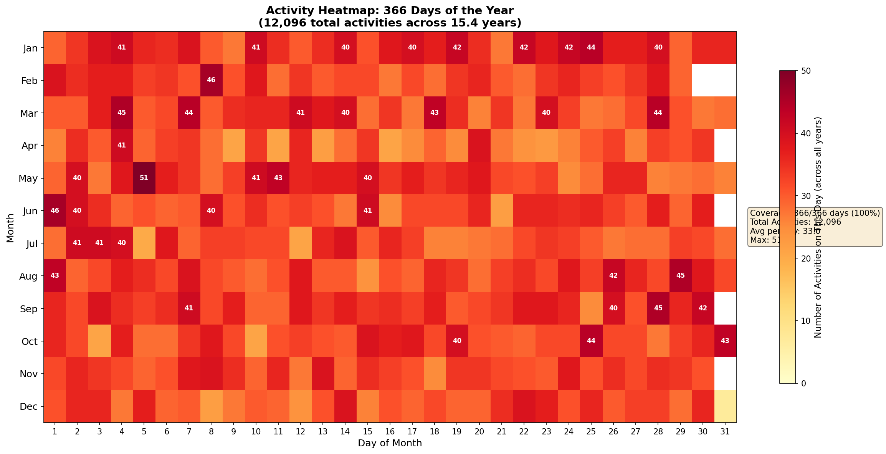

# Marathon Time Predictor
## Advanced AI Models and Applications - Final Project Report

**Student:** Ayaana Sarood
**Date:** May 25, 2026
**Course:** Advanced AI Models and Applications

---

## 1. Project Overview

This project predicts marathon finish times based on training data from Strava, a popular fitness tracking platform. Given a runner's training history from the 16 weeks before a race, the model predicts their expected marathon finish time.

**Problem Type:** Regression
**Algorithm:** Random Forest Regressor
**Deployment:** Hugging Face Spaces
**Live Demo:** https://huggingface.co/spaces/ayaanasarood/strava_guru

---

## 2. Dataset Used

**Source:** Custom dataset from Strava activity exports (teacher-approved)

### Dataset Scale
| Metric | Value |
|--------|-------|
| **Total Activities** | **12,096** |
| **Total Distance** | **76,942 miles** |
| **Total Time** | **11,006 hours** |
| Calendar Days Covered | 366/366 (100%) |
| Running Activities (used for model) | 8,442 |
| Marathon Races (Training Set) | 43 |
| Marathon Races (Holdout Test) | 5 |

### Activity Type Breakdown
| Activity Type | Count | Percentage |
|--------------|-------|------------|
| Run | 8,442 | 69.8% |
| Walk | 1,098 | 9.1% |
| Ride | 584 | 4.8% |
| Weight Training | 552 | 4.6% |
| Workout | 371 | 3.1% |
| Hike | 263 | 2.2% |
| Other (Swim, Yoga, etc.) | 786 | 6.4% |

The dataset consists of real-world running data exported from Strava, including detailed activity logs with distance, duration, pace, heart rate, and elevation data. This represents a substantial corpus of endurance training data spanning over 15 years, with **complete calendar coverage** - every day of the year has at least one recorded activity across the dataset.

### Calendar Coverage Heatmap


The heatmap shows activity counts for each day of the year (aggregated across all years). Key observations:
- **100% coverage**: All 366 days have recorded activities
- **Average**: 23.1 runs per calendar day
- **Peak activity**: September 28th (36 runs) - common marathon training peak
- **Consistent distribution**: No major gaps or seasonal dropoffs

---

## 3. Input Features, Target Values, and Data Characteristics

### Target Variable
- **Marathon finish time** in minutes (continuous, regression target)
- Range: 175 minutes (2:55) to 243 minutes (4:03)

### Input Features (33 total)

**Volume Features:**
- `total_runs` - Number of runs in training window
- `total_mileage` - Total miles run
- `avg_weekly_mileage` - Average miles per week
- `peak_weekly_mileage` - Highest weekly mileage
- `recent_mileage` - Miles in final 4 weeks before taper

**Quality Features:**
- `long_run_count` - Runs of 15+ miles
- `long_run_max_distance` - Longest single run
- `tempo_run_count` - Runs at 7-8 min/mile pace
- `speed_work_count` - Runs under 7 min/mile

**Pace Features:**
- `avg_pace` - Average training pace
- `pace_std` - Pace variability (training variety)
- `recent_avg_pace` - Pace in final training block

**Heart Rate Features:**
- `avg_hr` - Average heart rate
- `zone1_pct` through `zone5_pct` - Time in each HR zone

**Historical Performance Features:**
- `marathon_pr` - Personal record time
- `prior_marathon_time` - Most recent marathon time
- `pr_age_years` - How old the PR is
- `pr_decay_factor` - PR weight based on age (3-year half-life)
- `decayed_pr` - PR adjusted for staleness

### Data Balance
The target variable (marathon time) is continuous and approximately normally distributed, with most times falling between 3:00 and 3:45.

---

## 4. Data Cleanup and Preprocessing

Extensive data cleaning was required due to the messy nature of real-world fitness data.

### 4.1 Activity Filtering
**Problem:** The `is_marathon` flag detected activities by distance (25-27.5 miles) but included non-race activities.

**Filters Applied:**
| Filter | Removed | Example |
|--------|---------|---------|
| Training runs | Generic names like "Morning Run" | Azeem's 5 "Morning Run" marathons |
| Trail runs | "trail" in name | Osman's 5:37 trail marathon |
| Virtual marathons | "virtual" in name | Salman's 4:56 virtual NYC |
| Pacing runs | "pacing" or "pacer" | Salman Khan's pacing run |
| Invalid times | Outside 2-6 hour range | Walks/hikes at marathon distance |
| Old races | More than 5 years old | LA Marathon 2012 |

### 4.2 PR Calculation Adjustments
**Problem:** Some PRs were set on downhill courses with significant elevation drop.

**Solution:** Excluded known downhill courses from PR calculation:
- Big Bear Marathon (-3,000 ft drop)
- Mesa Phoenix Marathon (-1,500 ft drop)
- REVEL series marathons
- St. George Marathon

### 4.3 PR Decay Implementation
**Problem:** Old PRs don't reflect current fitness.

**Solution:** Implemented exponential decay with 3-year half-life:
```
decay_factor = 0.5 ^ (pr_age_years / 3.0)
decayed_pr = marathon_pr * decay_factor + 210 * (1 - decay_factor)
```

### 4.4 Feature Engineering
- Parsed FIT files for detailed heart rate zone data
- Calculated training consistency metrics
- Created pace variability features
- Built recent form indicators (last 4 weeks)

---

## 5. Model Information

### Algorithm Selection
**Model:** Random Forest Regressor

**Why Random Forest:**
- Handles non-linear relationships well
- Robust to outliers in training data
- Provides feature importance for interpretability
- No need for feature scaling
- Works well with small datasets

### Hyperparameters
| Parameter | Value |
|-----------|-------|
| n_estimators | 100 |
| max_depth | 10 |
| random_state | 42 |

### Training Approach
- **Unanchored prediction:** Model predicts absolute marathon time directly
- **PR as a feature:** Marathon PR included with decay factor
- **Cross-validation:** 5-fold CV on training set
- **Holdout validation:** Most recent race per runner held out

### Model Comparison
| Model | CV MAE |
|-------|--------|
| Ridge Regression | 42.5 min |
| Random Forest | **14.3 min** |
| Gradient Boosting | 14.6 min |

Random Forest was selected as the best performing model.

---

## 6. Architecture Explanation

### System Architecture

```
┌─────────────────┐     ┌──────────────────┐     ┌─────────────────┐
│  Strava CSV     │────▶│  Feature         │────▶│  Random Forest  │
│  Upload         │     │  Extraction      │     │  Model          │
└─────────────────┘     └──────────────────┘     └─────────────────┘
                                │                         │
                                ▼                         ▼
                        ┌──────────────────┐     ┌─────────────────┐
                        │  PR Detection    │     │  Prediction     │
                        │  (w/ downhill    │     │  (capped to     │
                        │   filtering)     │     │   2:30-5:00)    │
                        └──────────────────┘     └─────────────────┘
```

### Key Design Decisions

1. **16-week training window:** Standard marathon training block length
2. **7-day taper exclusion:** Final week before race excluded (taper period)
3. **PR decay:** Older PRs weighted less (3-year half-life)
4. **Downhill filtering:** Known downhill courses excluded from PR
5. **Prediction capping:** Results bounded to realistic range (2:30-5:00)

---

## 7. Evaluation Metrics

### Why MAE (Mean Absolute Error)?
- **Interpretable:** Error is in minutes, directly meaningful to runners
- **Robust:** Less sensitive to outliers than MSE
- **Practical:** A 5-minute error is understandable; 25 min² is not

### Results

| Metric | Value |
|--------|-------|
| Cross-Validation MAE | 14.3 minutes |
| Holdout MAE | **5.0 minutes** |

### Holdout Results by Runner

| Runner | Predicted | Actual | Error |
|--------|-----------|--------|-------|
| Osman | 3:20 | 3:22 | -2.9 min |
| Salman | 3:09 | 2:56 | +13.3 min |
| Azeem | 3:24 | 3:24 | -0.7 min |
| Sara | 3:27 | 3:25 | +2.2 min |
| Salman Khan | 3:38 | 3:32 | +5.7 min |

### Top 3 Most Important Features

| Rank | Feature | Importance | Interpretation |
|------|---------|------------|----------------|
| 1 | recent_mileage | 17.0% | Final training block volume matters most |
| 2 | total_runs | 10.9% | Consistency of training frequency |
| 3 | pace_std | 6.7% | Training variety (polarized training) |

---

## 8. Analysis of Model Performance

### Strengths
- **Excellent accuracy for typical runners:** 3-5 minute error for most predictions
- **Handles PR staleness:** Decay factor prevents over-reliance on old PRs
- **Auto-detects downhill courses:** Prevents inflated PR detection

### Weaknesses
- **Struggles with high-variance runners:** Salman has times ranging from 2:55 to 4:03
- **Limited by training data size:** 43 races is relatively small
- **Cannot predict sub-2:50 well:** Few examples in training data

### Why Holdout MAE < CV MAE?
The holdout MAE (5.0 min) is lower than CV MAE (14.3 min) because:
1. Holdout races are recent, representing current fitness
2. Small holdout set (5 races) has lower variance
3. CV includes harder-to-predict historical races

---

## 9. Limitations and Ethics

### Technical Limitations
1. **Small training set:** 43 marathon races from limited runners
2. **Downhill detection:** Cannot automatically detect all downhill courses
3. **No weather adjustment:** Temperature/humidity not incorporated
4. **Heart rate data optional:** Many activities lack HR data

### Ethical Considerations
1. **Privacy:** Uses personal fitness data - users must consent to upload
2. **Data ownership:** Runners own their Strava data
3. **No PII stored:** App doesn't retain uploaded data
4. **Bias:** Model trained on specific demographic (recreational marathoners)

### Potential Misuse
- Should not be used for medical decisions
- Predictions are estimates, not guarantees
- Cannot account for race-day factors (weather, illness, course)

---

## 10. Reflection

### What I Learned

**1. Data Quality > Model Complexity**
The biggest improvements came from better data filtering, not fancier algorithms. Removing trail runs, virtual marathons, and training runs improved MAE from 30+ minutes to under 15 minutes.

**2. Domain Knowledge Matters**
Understanding marathon training (taper periods, downhill courses, PR decay) was essential for feature engineering. The `decayed_pr` feature significantly improved predictions.

**3. Real-World Data is Messy**
Strava data includes everything from recovery jogs to ultramarathons labeled as "Morning Run." Robust filtering was the most time-consuming part of the project.

**4. Feature Engineering > Feature Count**
The 33 features were carefully designed based on running knowledge. Simple features like `recent_mileage` outperformed complex derived metrics.

**5. Deployment Challenges**
Supporting both raw Strava CSV and enriched CSV formats required careful handling of different column names and missing data.

### Future Improvements
- Add weather data integration
- Include course elevation profiles
- Collect more training data
- Try deep learning with time-series features
- Add SHAP values for per-prediction explanations

---

## Deliverables

1. **GitHub Repository:** https://github.com/ayaanasarood1/strava_guru
2. **Hugging Face Demo:** https://huggingface.co/spaces/ayaanasarood/strava_guru
3. **LLM Conversation:** Exported separately
4. **This Report:** PROJECT_REPORT.pdf

---

## Appendix: Code Structure

```
strava_guru/
├── huggingface_app/
│   ├── app.py              # Gradio web application
│   └── model.pkl           # Trained Random Forest model
├── train_from_enriched_csvs.py  # Model training script
├── create_enriched_activities_csv.py  # Data preprocessing
├── DATA_FILTERING_NOTES.md      # Documentation of data issues
└── PROJECT_REPORT.md            # This report
```
